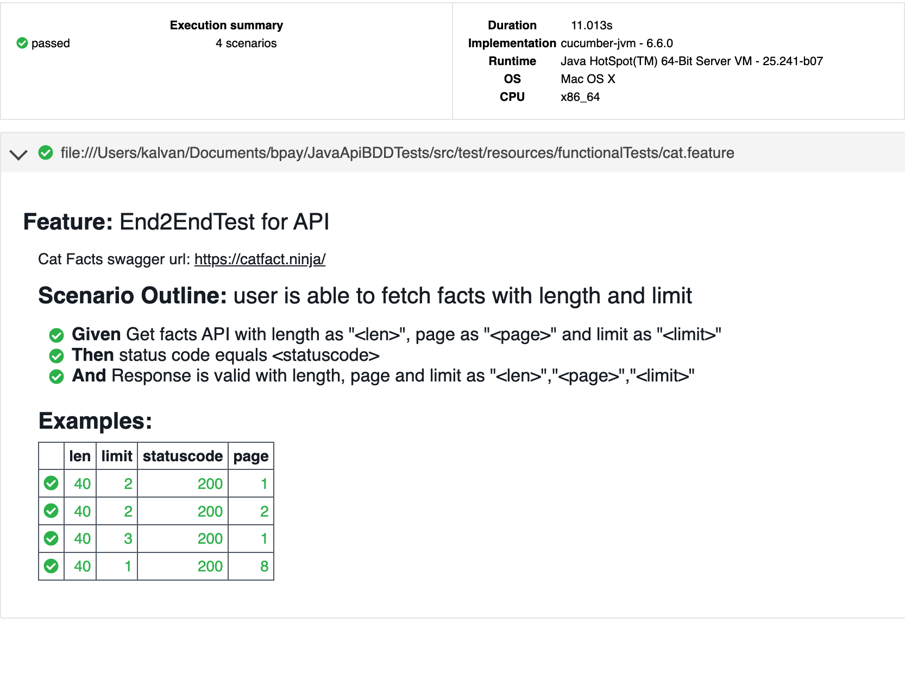

# APIBDD
API automation using Java, Cucumber, RestAssured and Junit

## PreRequisites
```
Maven will take care of all dependency management
Make sure you have
- Java
- Maven
```

## Execute
```
mvn clean install
```

## Reporting
Test run using Docker is screen recorded and uploaded in this project as APITestRunUsingDocker.mov. Feel free to watch it.


## To Do
- [ ]  Schema validations for json response
- [ ]  DB data based validation
- [ ]  Write more utils for API validations
- [ ]  Integrate with CI/CD pipelines

## Other usecases that could be automated
Different tests to explore the behaviour for boundary values of limit and max_length like negative integers for max_length and such.
Adding more validation on the content of the facts returned in response payload.
Adding more validation on response headers.

